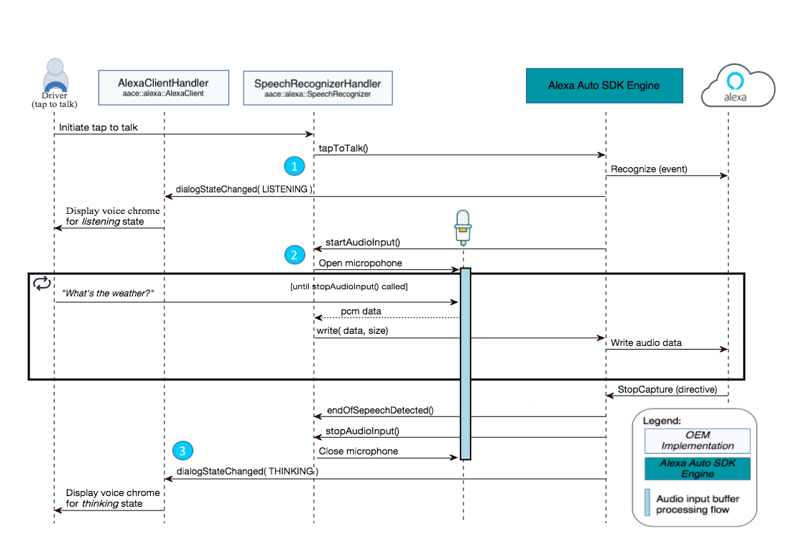
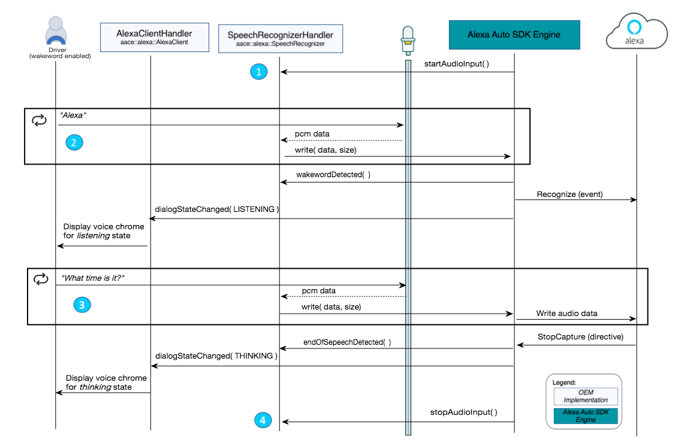

# Alexa Module Sequence Diagrams for Alexa Auto SDK

The following sequence diagrams illustrate two of the basic flows used in the Alexa Auto SDK.

**Table of Contents**

* [Tap to Talk Sequence Diagram](#tap-to-talk-sequence-diagram)
* [Wake Word Enabled Sequence Diagram](#wake-word-enabled-sequence-diagram)

## Tap to Talk Sequence Diagram <a id ="tap-to-talk-sequence-diagram"></a>

This sequence diagram illustrates the initial sequence followed to access Alexa through the automotive tap to talk flow. The driver initiates the  action by pushing the voice button located in the car.

Once the driver pushes the voice button, Alexa is brought to a listening state ready for voice input, processing, and playback.

This diagram includes the actual names and syntax for the methods and functions used in the Alexa Auto SDK.

> **Note**: Tap to Talk can be used with PCM and OPUS audio formats.



> **Tip**: Tap to Talk can be used to initiate speech recognition from external services such as external wake word engines, physical voice command buttons, and on screen buttons from the In-vehicle Voice Infotainment (IVI) system.

### Tap to Talk Flow Summary

1. The driver pushes the voice button in the car. This specific human action puts Alexa into a listening state. There should be a visual indication to the driver that Alexa is now ready for audio input.  

1. The car's microphone is now actively receiving voice input and preparing an audio buffer to send to the Alexa Auto SDK Engine. The Alexa Auto SDK Engine audio input function loops until a directive is returned indicating that the audio input has finished.  

1. A visual indication should be displayed on the head unit screen indicating that Alexa is in a thinking state. In this state, Alexa is processing the input buffer and creating an appropriate response type. In this example Alexa is creating an audio out file that is sent to the cars head unit to play.  

## Wake Word Enabled Sequence Diagram <a id= "wake-word-enabled-sequence-diagram"></a>

This sequence diagram illustrates the initial sequence followed to access Alexa with the wake word enabled. The driver initiates the action by uttering the Alexa wake word.

This diagram includes the actual names and syntax for the methods and functions used in the Alexa Auto SDK.

> **Note**: WWE can be used with PCM audio format only.



### Wake Word Enabled Flow Summary

1. ```startAudioInput()``` is called when wake word detection is enabled. This occurs when the Engine is started if wake word is enabled by default, or when ```enabledWakewordDetection()``` is explicitly called by the application. When this happens, the application must start sending audio samples from the microphone to the Engine.

1. Audio is processed locally by the wake word engine until the wake word is detected. Once the wake word is detected, the Engine notifies the application that the dialog state has changed to "listening" and initiates a Recognize event with Alexa.

1. While in the listening state, audio data is sent to Alexa until the end of speech is detected. Once the end of speech is detected, Alexa sends a ```StopCapture``` directive to the Engine and the dialog state is changed to "thinking." Alexa then respond with additional directives in response to the speech request.

1. The application should continue to send audio to the Engine until ```stopAudioInput()``` is received. When wake word is enabled, this happens when the Engine is stopped, or when ```disableWakewordDetection()``` is explicitly called by the application.
