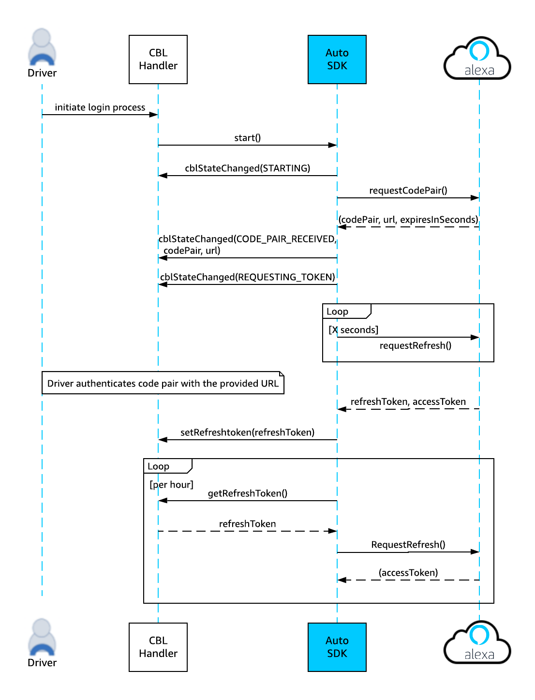
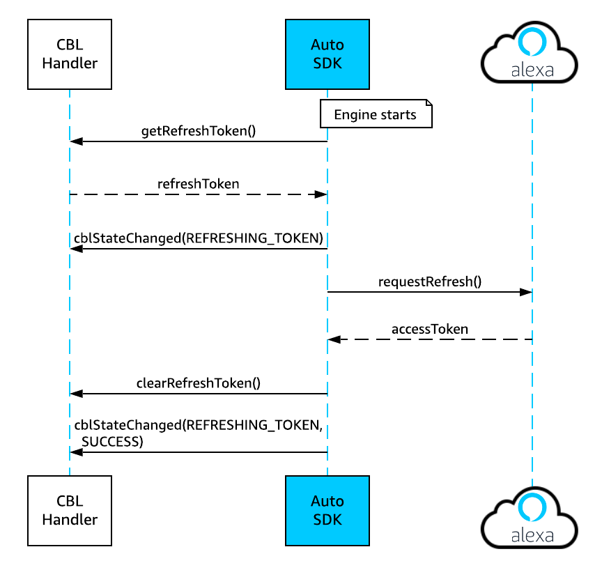
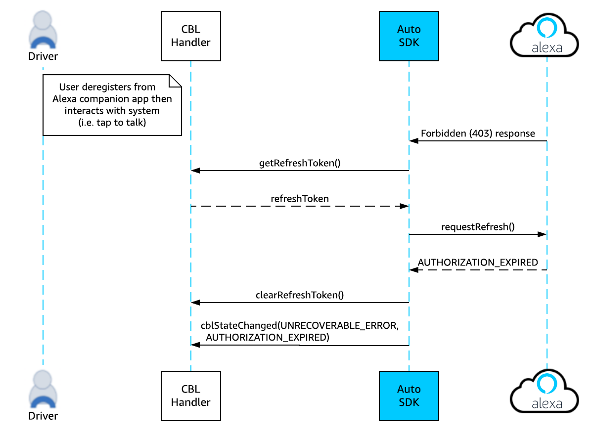
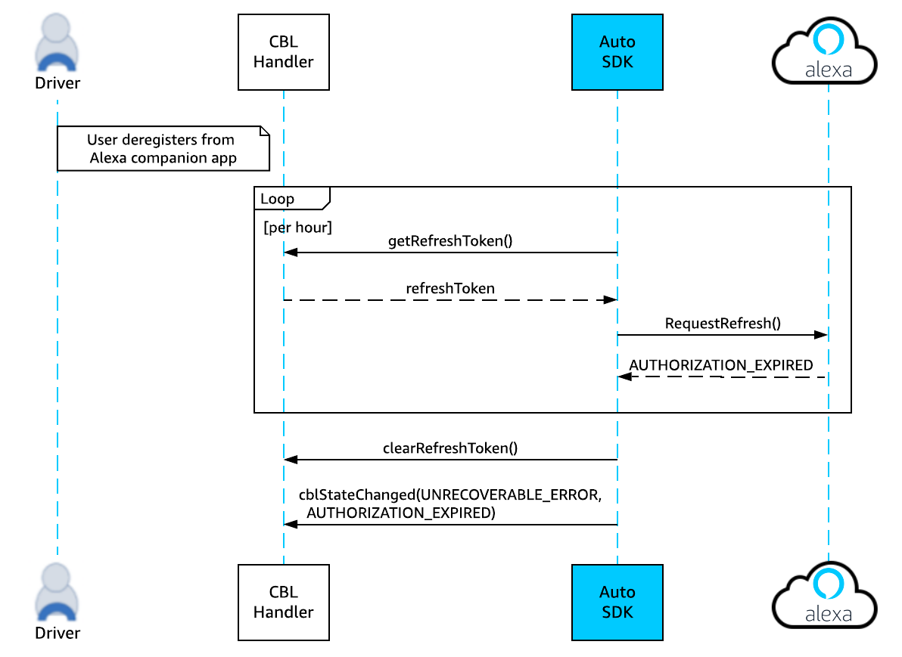

# Code-Based Linking (CBL) Module

The Code-Based Linking (CBL) module implements the CBL mechanism of acquiring Login with Amazon (LWA) access tokens.

**Table of Contents**

* [Overview](#overview)
* [Implementing a Custom CBL Handler](#implementing-a-custom-cbl-handler)
* [CBL States and State Change Reasons](#cbl-states-and-state-change-reasons)
* [CBL Sequence Diagrams](#cbl-sequence-diagrams)

## Overview <a id ="overview"></a>

Every request to AVS requires an Login with Amazon (LWA) access token. The Alexa Auto SDK CBL module implements the [CBL mechanism](https://developer.amazon.com/en-US/docs/alexa/alexa-voice-service/code-based-linking-other-platforms.html) of acquiring such tokens. Using the CBL module is an alternative to acquiring access tokens yourself using your custom implementation of the more general [`AuthProvider` platform interface](../alexa/README.md#handling-authentication) To use the CBL module, register a `CBL` platform interface implementation with the Engine. The Engine implementation of CBL acquires and refreshes the access tokens for you; however, it does not store refresh tokens. It also notifies your CBL implementation about the state of the authentication flow.

## Implementing a Custom CBL Handler <a id = "#implementing-a-custom-cbl-handler"></a>
To implement a custom CBL handler, extend the `CBL` class:

```
public class CBLHandler extends CBL
{

    // Notify the platform about an authentication flow
    @Override
    public void cblStateChanged( CBLState state, CBLStateChangedReason reason, String url, String code ) {
        // The state describes the state of the authentication flow
        // The reason provides the reason for the state change
        //The user visits the URL, logs in with their Amazon account and enters the code to link the device to their account. Your implementation is responsible for displaying this information to the user. URL and code will only be provided in the relevant CBL state; otherwise they are empty strings.
    }

    @Override
    public void clearRefreshToken() {
        // Remove refresh token from platform application
    }

    @Override
    public void setRefreshToken( String refreshToken ) {
        // Set refresh token
        // The Auto SDK Engine refreshes your access token when necessary; however it doesn't store the refresh token. Your platform implementation stores the refresh token but does not refresh it.
    }

    @Override
    public String getRefreshToken() {
        // Return the refresh token that was most recently provided with setRefreshToken(). If no token is available, return an empty string.
    }

    @Override
    public void setUserProfile( String name, String email ) {
        // Provides information about the user who logged in with their Amazon credential during the authentication flow. This is not enabled by default and won't be called unless you enable a user profile in your Engine configuration.
    }

    // Begin authentication flow
    start();
    ...

    // Cancel authentication flow
    cancel();
    ...

    // Reset authentication state
    reset();
    ...
}
```
```
/* Configure the Engine
 CBL configuration is optional.
 To configure user profile, for example, provide this block in your Engine configuration:
 
{
    "aace.cbl": {
        "enableUserProfile": true
    }
}
*/

//If you want to generate this configuration programmatically:

{
    EngineConfiguration cblConfig = cblConfiguration.createCBLUserProfileConfig( true );
    mEngine.configure( new EngineConfiguration[]{
	// other config objects,
	cblConfig,
	...
	
    });
}

...

// Register the platform interface with the Engine
mEngine.registerPlatformInterface ( new MyCBLHandler() );

```

```
// Your platform implementation is responsible for starting and ending the CBL flow.

// To start the authentication process:
m_cblHandler.start();

// At this point, your implementation will be notified to provide the URL and code to the user.

...

// To cancel the authentication process:
m_cblHandler.cancel();

...

// To reset the authentication process:
m_cblHandler.reset();
```

## CBL States and State Change Reasons <a id = "cbl-states-and-state-change-reasons"></a>

When you [implement a custom CBL handler](#implementing-custom-cbl-handler), the Engine notifies your platform interface implementation about CBL authentication flow [states](#cbl-states) and [state change reasons](#cbl-state-change-reasons) via the `cblStateChanged()` method.

### CBL States <a id="cbl-states"></a> 

When a state change in the CBL authentication flow occurs, the Engine passes the new state to your CBL platform interface implementation via the `CBLState` argument in the `cblStateChanged()` method. `CBLState` can have the following values:

* `STARTING` - The CBL authentication process is starting.

* `REQUESTING_CODE_PAIR` -  The Engine is requesting a code pair to authenticate a  user. The following events cause the CBL state to change to `REQUESTING_CODE_PAIR`:
 
    * Your implementation does not store a refresh token after the `REQUESTING_TOKEN` phase, and the Engine does not get a refresh token when CBL is in the `STARTING` state.
    * The LWA service sends an `INVALID_CODE_PAIR` response to the Engine's request for an access token.
    * The LWA service sends an `INVALID_CODE_PAIR` response to the Engine's request for a refresh of the access token.

* `CODE_PAIR_RECEIVED` - The code pair was received successfully from the LWA service. 

* `REQUESTING_TOKEN` -  The Engine is requesting an access token from the LWA service.
The CBL state  changes to `REQUESTING_TOKEN` when, after the `CODE_PAIR_RECEIVED` phase, the Engine has received the code pair and the user has been authenticated successfully using this code pair.

* `REFRESHING_TOKEN` -  The access token is currently being refreshed. The following events cause the CBL state changes to `REFRESHING_TOKEN`:
    
    * Your implementation stores a refresh token which can be used to refresh the access token after the `STARTING` phase, .
    * The Engine successfully receives the access token from the LWA service after the `REQUESTING_TOKEN` phase.

    After the CBL state transitions to `REFRESHING_TOKEN`, it remains in that state until the user resets or cancels the CBL authentication or the access token is refreshed. The access token is refreshed only when one of the following events take place:

    * The current access token expires.
    * An authorization failure (a "Forbidden 403" response from AVS) occurs because an invalid access token is used to make a request to AVS.

* `STOPPING` - The CBL process is stopping. The following events cause the CBL state to change to `STOPPING`:
    * The user resets or cancels the CBL authentication.
    * In the `REQUESTING_CODE_PAIR` state, the request for a code pair returns an `INVALID_CBL_CLIENT_ID`.
    * In the `REQUESTING_TOKEN` state, the code pair has expired and the user is no longer authenticated or the request for an access token returns an `AUTHORIZATION_EXPIRED` or `INVALID_CBL_CLIENT_ID`response.
    * In the `REFRESHING_TOKEN` state, the request to refresh the access token returns an `AUTHORIZATION_EXPIRED` or `INVALID_CBL_CLIENT_ID` response.

### CBL State Change Reasons <a id = "cbl-reasons"></a>

When a state change in the CBL authentication flow occurs, the Engine passes the reason for the state change to your CBL platform interface implementation via the `CBLStateChangedReason` argument in the `cblStateChanged()` method. `CBLStateChangedReason` can have the following values:

* `SUCCESS` - The CBL state was changed successfully. The `SUCCESS` reason also indicates that any request that AVS made to the LWA service in any of the [CBL authentication flow states](#cbl-states) was successful.

* `ERROR` - An error occurred in the CBL process. A request that AVS made to the LWA service in one of the [CBL authentication flow states](#cbl-states) resulted in an unknown error.

* `TIMEOUT` - A request that AVS made to the LWA service in one of the [CBL authentication flow states](#cbl-states) resulted in a request timeout.

* `CODE_PAIR_EXPIRED` - The code pair required for user authentication has expired. The user must request another code pair.

* `AUTHORIZATION_EXPIRED` - The authorization has expired. The LWA service sends this response when the user deregisters the device from the Alexa Companion App, which in turn invalidates the refresh and access tokens. Any subsequent requests made to AVS (either by the user or due to default polling after a specified time interval) result in a "Forbidden 403" response. This triggers a refresh of the access token to the LWA service which returns  an `AUTHORIZATION_EXPIRED` response since the refresh token has been invalidated.

* `NONE` - The reason for the CBL state change is unknown.


## CBL Sequence Diagrams <a id = "cbl-sequence-diagrams"></a>

The following sequence diagrams provide an overview of the CBL authentication flow, the process of refreshing the authentication when the application provides a valid refresh token, and the flow when the user deregisters from the Alexa companion application and the device is notified either via user interaction or inactivity.

### Initial Authentication Flow Sequence Diagram

This diagram illustrates the initial CBL authentication flow.



### Authentication Refresh Sequence Diagram

This diagram illustrates the flow when CBL refreshes the CBL authentication on startup.


### User Deregistration

This diagram illustrates the flow when the user deregisters from the Alexa companion application and the device is notified when the user interacts with the system after deregistering from the Alexa companion application.



This diagram illustrates the flow when the user deregisters from the Alexa companion application and the device is notified when the getRefreshToken() request loop times out.

